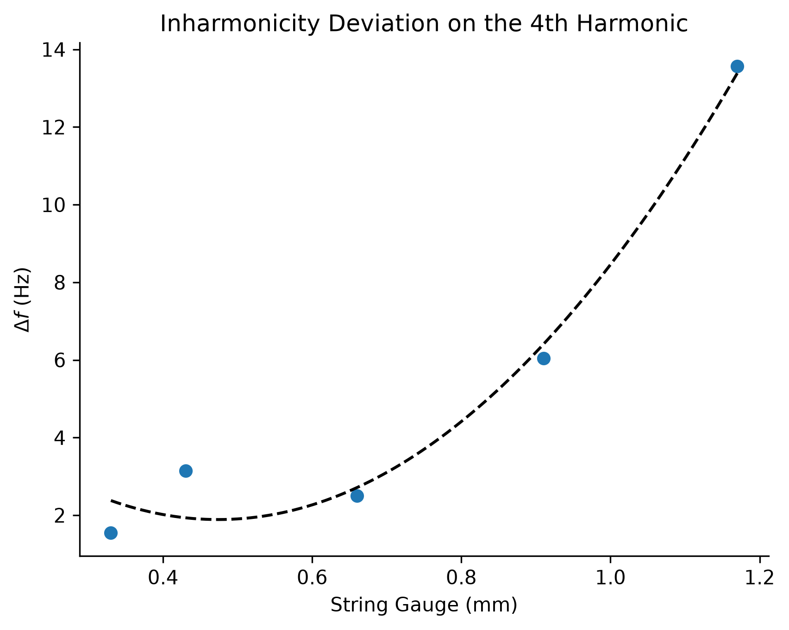
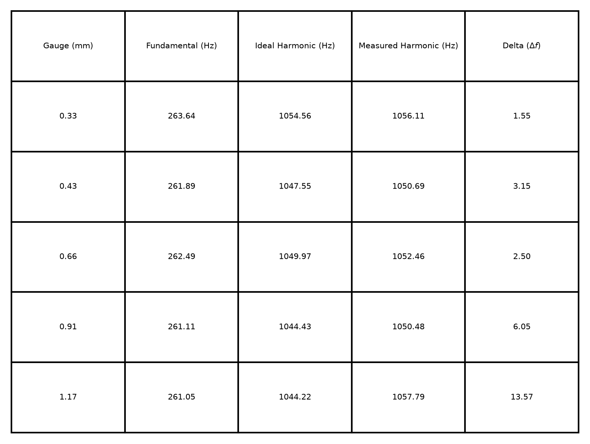

# The Inharmonicity of Stiffness in Guitar Strings

## Introduction

When a continuous string vibrates, the string emits a fundamental frequency.
The overtones produced from this fundamental frequency are integer multiples of the fundamental frequency.
Goldstein (2002) derives the equation of motion for this continuous string as $\mu\ddot{\eta} - Y\frac{d^2\eta}{dx^2}=0$ (p. 579).
Because the displacement of the string ($\eta$) is a dynamic function of both its physical position ($x$) and time ($t$), this relationship can be expressed as the following partial differential equation:
$$\mu\frac{\partial^2\eta}{\partial t^2} - Y\frac{\partial^2\eta}{\partial x^2}=0$$

If we solve this equation, we end up with the harmonic series, where every overtone is a perfect integer multiple of the fundamental frequency $f_n=nf_1$.

This equation breaks down when we account for the string's physical properties (stiffness and tension). 
This is especially pertinent in the guitar, where the same fundamental frequency can be played on strings of varying stiffness and tension.
To account for this, the ideal equation ($f_n=nf_1$) becomes $f_k=kf_0\sqrt{1+\beta k^2}$ (Bastas et al., 2022).
As the overtone number ($k$) increases, the stiffness multiplier ($\sqrt{1+\beta k^2}$) acts as a restoring force that pushes the measured frequency further away from the integer multiple of the ideal string.
This is called inharmonicity and is thus represented as the inharmonicity coefficient ($\beta$).

Because the deviation in frequency ($\Delta f$) is too small to detect with ordinary acoustic tools, we will be measuring using Digital Signal Processing (DSP).
Namely, we will apply a Fast Fourier Transform (FFT) to convert the audio from the time domain into the frequency domain.
This will allow us to find the exact frequency peaks of the fundamental note and its resulting overtones (Carvalho et al., 2018).

## Hypothesis

If the mass density of a guitar string is increased while holding the fundamental frequency constant, then $\Delta f$ of the 4th harmonic will increase in magnitude, because the increased physical stiffness of the thicker string acts as a stronger restoring force.
As we move to thicker strings, $\Delta f$ will show a greater deviation from the ideal integer multiple than the thinner strings do.

## Method

To conduct this experiment, we will use a six-string guitar and play a C4 on the bottom five strings.
C4 was chosen because it excludes any open notes (notes where no fretting pressure is applied) and represents a fretting possibility within the designs of the guitar.
Fundamental frequencies on the guitar are repeated on each string within a 5-note interval of each other (and a 4-note interval between the 2nd and 3rd string).
The choice must fall within the bounds of frets 1-24. External methods of fretting beyond the 24th fret are out of scope for this experiment.
This excludes only the thinnest string, as the difference in thickness between the highest and second-highest strings represents the smallest difference between two strings.

We will specifically be interested in the 4th harmonic. The 4th harmonic is chosen because it gives a large enough multiplier to show a meaningful deviation from string thickness.
All frequencies (fundamental frequency, harmonic frequencies, $\Delta f$) will be quantified and measured in Hertz (Hz).
The actual set of strings will be Elixir Optiweb coated guitar strings.
These strings are made from nickel-plated steel and measure as follows (thickness is measured in mm for this experiment, but the inch gauge is listed below for comparison):

* **1st string** - .010 inches (0.25 mm) NOT IN TEST
* **2nd string** - .013 inches (0.33 mm)
* **3rd string** - .017 inches (0.43 mm)
* **4th string** - .026 inches (0.66 mm)
* **5th string** - .036 inches (0.91 mm)
* **6th string** - .046 inches (1.17 mm)

The DSP and plotting algorithms are utilized strictly as digital measurement instruments to observe and quantify physical waveforms.
For replicability, these data acquisition parameters must remain constant.
The raw audio will be recorded at a sample rate of 48 kHz and 24-bit depth.
The FFT algorithm will process these physical recordings using a constant window size of 4096.
These parameters create the width of each frequency bin:

$$ f_{width} = \frac{\text{SampleRate}}{\text{WindowSize}} $$

This ensures the spectral resolution of the measured $\Delta f$ remains consistent across each string measurement.

The guitar in question will have a fresh set of 6 strings before the experiment to control for string age.
New guitar strings, when pulled to their desired tension, can take some time to stretch and reach their ideal elasticity.
So the strings will each be lightly played over the course of 2 days to account for this.
This will mitigate errors introduced by fraying strings or strings continuing to stretch as we record for our experiment.
We will be using a 1mm guitar pick held exactly 3cm from the bridge to control for pluck position.
Consistent pluck position is important because plucking closer to the bridge will increase the amplitude of the frequencies.
Amplitude is not necessarily the quantity being measured in this experiment, but it can introduce noise and error that we still want to control for.
The guitar pick will be held with the flat side exactly parallel to the guitar string.
The guitar pick will be set resting on the guitar string before each pluck to control for pick attack.
This reduces potential artifacts from scratching in the signal.
Additionally, a stronger pick attack can cause deviations in the fundamental frequency, which reduce the overall confidence of the experiment.

We will start on the 2nd string.
To ensure each string plays the same fundamental frequency (C4 = 261.63 Hz), each note will be tuned to the controlled frequency before recording.
This will be recorded within a margin of error of +/- 3 Hz.
We will play the fundamental frequency, recorded as a waveform, through a Line 6 Helix as a dry signal (with no amplifiers or processing effects).
To ensure deterministic data extraction, the raw audio file will be trimmed to remove the initial attack transient.
This will be done by locating the peak amplitude and applying a 100 ms offset to ensure the string has settled into its periodic waveform.
To perfectly fit a 4096-sample window at 48 kHz without zero-padding, the audio must be exactly 85.33 ms long.
This will be achieved by extracting exactly 4096 samples and passing them through a windowing function (Hann window function) to eliminate leakage from non-zero-crossing boundaries.
This will be repeated with the same fundamental frequency on a string of increased stiffness until we reach the bottom string.
These measured harmonics will be processed through our FFT to get the frequency deviation.
We will then plot the experimental deviations on a graph showing the dependence of harmonic frequency deviation on string thickness.

## Result

As can be seen in the figures above, each time the string stiffness is increased, the frequency deviation ($\Delta f$) grows.
The data trends as a non-linear, quadratic curve.
Some deviations are actually within the margin of error we set for our fundamental frequency (+/- 3 Hz).
However, this is only true for the B string (0.33mm) and the D string (0.66mm).
This means that the inharmonicity at those gauges is mathematically indistinguishable from standard tuning variance.
The last two strings represent an increase in deviation of more than double the previous string (2.50 Hz -> 6.05 Hz -> 13.57 Hz).

Note the jump in the data from the G string (0.43mm) to the D string (0.66mm).
This stems from the switch from unwound strings (B and G strings) to wound strings (D, A, and low E strings).
The winding adds mass but adds no stiffness.
Since the stiffness of the string is entirely determined by its core, the solid core of the wound 0.66mm D string is likely physically thinner than the solid unwound 0.43mm G string.
If true, this would mean it would exhibit a lower restoring force and thus, a smaller deviation.

## Conclusions

The findings confirm the hypothesis that increasing a string's stiffness while holding the fundamental frequency constant results in a greater deviation from the ideal harmonic frequency.
The equation $f_k=kf_0\sqrt{1+\beta k^2}$ represents the physical properties of the string acting as a restoring force that quadratically pushes the overtones sharp.
This relationship is confirmed by the empirical data gathered from the experiment, which demonstrates a non-linear, quadratic increase in deviation from 1.55 Hz on the thinnest string to 13.57 Hz on the thickest string.

While the findings confirm the hypothesis, the experiment could have controlled for intonation and fretting pressure.
When a finger presses down on a fret, the amount of pressure can cause the fundamental frequency to go slightly sharp.
This was mitigated by tuning the fretted string to the fundamental frequency being controlled, but inconsistencies in the human hand still introduce some error in the measured baseline.
This is likely the reason the fundamental frequencies of some strings fluctuated as they did (yet still within the defined variance threshold).
A more consistent approach would be to use a spring-controlled capo tuned to a specific clamping force in newtons.
This would remove the error of fretting pressure.

It is also clear from the data that the methodology of measuring mass density using the string gauge could be improved.
A future experiment could control for wound or unwound strings, intonation (through a multiscale guitar, or an equal-tempered fret guitar), or, best of all, find an empirically concrete measurement for thickness.
All of these were out of scope for this particular experiment, but they are ideas worth exploring for follow-up experiments.

## Sources
* Bastas, G., Koutoupis, S., Kaliakatsos-Papakostas, M., Katsouros, V., & Maragos, P. (2022). A Few-Sample Strategy for Guitar Tablature Transcription Based on Inharmonicity Analysis and Playability Constraints. *ICASSP 2022 - 2022 IEEE International Conference on Acoustics, Speech and Signal Processing (ICASSP)*, 771–775. https://doi.org/10.1109/icassp43922.2022.9747169
* Goldstein, H., Poole, C., & Safko, J. (2002). *Classical mechanics*. Addison Wesley.
* de Carvalho, J. M., Gurjao, E. C., & Ribeiro Veloso, L. (2018). *Digital Signal Processing*. Momentum Press.